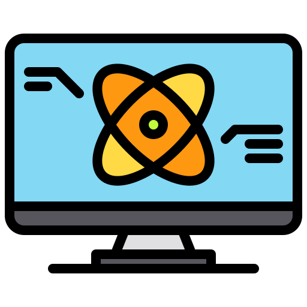

# About me

  

## Hi there, I'm Siddharth Golecha 👋

  
  

Avid learner experience in different technologies like:

### [  Artificial Intelligence](#Self-Driving-Cars) 
### [  Quantum Computing and Machine Learning]()
### [  Android Application Development]()
### [  Game Developement]()

<!-- Avid learner interested in different technologies like Artificial Intelligence, Quantum Cumputing and Machine Learning, -->
<!--  -->
# Contact Me

 

# Languages and Tools:

           

 
 

---

 
  
# My GitHub Stats

  
  

 
  
# My Language Stats

 
  
# My Top Repositories

# My Experience

## Self Driving Cars

  

Something to add later

